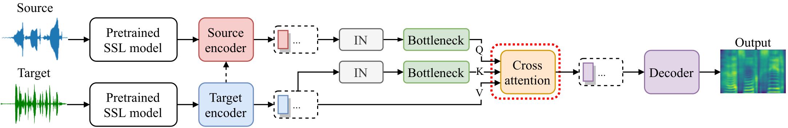

# S2VC

Here is the implementation of our paper [S2VC: A Framework for Any-to-Any Voice Conversion with Self-Supervised Pretrained Representations](https://arxiv.org/abs/2104.02901). In this paper, we proposed S2VC which utilizes Self-Supervised pretrained representation to provide the latent phonetic structure of the utterance from the source speaker and the spectral features of the utterance from the target speaker.

The following is the overall model architecture.



For the audio samples, please refer to our [demo page](https://howard1337.github.io/S2VC/).

## Usage

You can download the pretrained model as well as the vocoder following the link under **Releases** section on the sidebar.

The whole project was developed using Python 3.8, torch 1.7.1, and the pretrained model, as well as the vocoder, were turned to [TorchScript](https://pytorch.org/docs/stable/jit.html), so it's not guaranteed to be backward compatible.
You can install the dependencies with

```bash
pip install -r requirements.txt
```

If you encounter any problems while installing *fairseq*, please refer to [pytorch/fairseq](https://github.com/pytorch/fairseq) for the installation instruction.

### Self-Supervised representations
#### Wav2vec2
In our implementation, we're using Wav2Vec 2.0 Base w/o finetuning which is trained on LibriSpeech.
You can download the checkpoint [wav2vec_small.pt](https://dl.fbaipublicfiles.com/fairseq/wav2vec/wav2vec_small.pt) from [pytorch/fairseq](https://github.com/pytorch/fairseq).
#### APC(Autoregressive Predictive Coding), CPC(Contrastive Predictive Coding)
These two representations are extracted using this speech toolkit [S3PRL](https://github.com/s3prl/s3prl).
You can check how to extract various representations from that repo.

### Vocoder

The WaveRNN-based neural vocoder is from [yistLin/universal-vocoder](https://github.com/yistLin/universal-vocoder) which is based on the paper, [Towards achieving robust universal neural vocoding](https://arxiv.org/abs/1811.06292).

## Voice conversion with pretrained models

You can convert an utterance from the source speaker with multiple utterances from the target speaker by preparing a conversion pairs information file in YAML format, like
```YAML
# pairs_info.yaml
pair1:
    source: VCTK-Corpus/wav48/p225/p225_001.wav
    target:
        - VCTK-Corpus/wav48/p227/p227_001.wav
pair2:
    source: VCTK-Corpus/wav48/p225/p225_001.wav
    target:
        - VCTK-Corpus/wav48/p227/p227_002.wav
        - VCTK-Corpus/wav48/p227/p227_003.wav
        - VCTK-Corpus/wav48/p227/p227_004.wav
```

And convert multiple pairs at the same time, e.g.
```bash
python convert_batch.py \
    -w <WAV2VEC_PATH> \
    -v <VOCODER_PATH> \
    -c <CHECKPOINT_PATH> \
    -s <SOURCE_FEATURE_NAME> \
    -r <REFERENCE_FEATURE_NAME> \
    pairs_info.yaml \
    outputs # the output directory of conversion results
```

After the conversion, the output directory, `outputs`, will be containing
```text
pair1.wav
pair1.mel.png
pair1.attn.png
pair2.wav
pair2.mel.png
pair2.attn.png
```

## Train from scratch

### Preprocessing
You can preprocess multiple corpora by passing multiple paths.
But each path should be the directory that directly contains the speaker directories.
And you have to specify the feature you want to extract.
Currently, we support apc, cpc, wav2vec2, and timit_posteriorgram.
i.e.
```bash
python3 preprocess.py
    VCTK-Corpus/wav48 \
    <SECOND_Corpus_PATH> \ # more corpus if you want
    <FEATURE_NAME> \
    <WAV2VEC_PATH> \
    processed/<FEATURE_NAME>  # the output directory of preprocessed features
```
After preprocessing, the output directory will be containing:
```text
metadata.json
utterance-000x7gsj.tar
utterance-00wq7b0f.tar
utterance-01lpqlnr.tar
...
```

You may need to preprocess multiple times for different features.
i.e.
```bash
python3 preprocess.py
    VCTK-Corpus/wav48 apc <WAV2VEC_PATH> processed/apc
python3 preprocess.py
    VCTK-Corpus/wav48 cpc <WAV2VEC_PATH> processed/cpc
    ...
```

Then merge the metadata of different features.

i.e.
```bash
python3 merger.py processed
```


### Training

```bash
python train.py processed
    --save_dir ./ckpts \
    -s <SOURCE_FEATURE_NAME> \
    -r <REFERENCE_FEATURE_NAME>
```


You can further specify `--preload` for preloading all training data into RAM to boost training speed.
If `--comment <COMMENT>` is specified, e.g. `--comment CPC-CPC`, the training logs will be placed under a newly created directory like, `logs/2020-02-02_12:34:56_CPC-CPC`, otherwise there won't be any logging.
For more details, you can refer to the usage by `python train.py -h`.
